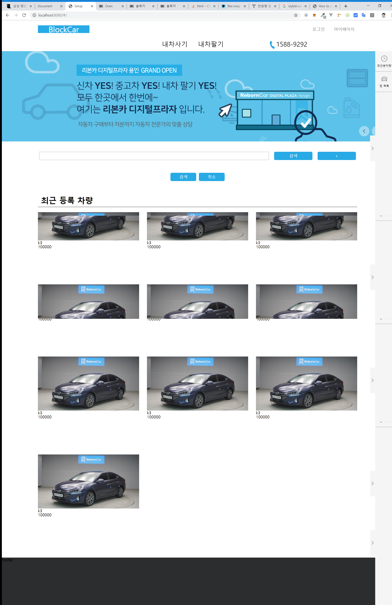

* TOC
{:toc}


## 1. MainPage

Main은 블록카 프로젝트의 시작 페이지입니다. Main페이지에는 아래와 같은 컴포넌트들을 사용합니다.  저는 styled-components를 사용했기 때문에 styled-component로 만든 컴포넌트도 아래에 포함시키도록 하겠습니다.   


아래의 두 컴포넌트는 모든 페이지에 공통적으로 사용될 컴포넌트이기 때문에 Router바깥에 선언하도록하겠습니다.  

- Header
- SideBar

`Router.tsx`

```js
(...중략...)

export default () => {
  return (
    <>
      <Header />
      <Sidebar></Sidebar>
      <Router>
        <Switch>
          <Route path="/" exact component={Main}></Route>
          <Route path="/search" exact component={Search}></Route>
          <Route path="/sellcar" exact component={SellCar}></Route>
          <Route path="/buycar" exact component={BuyCar}></Route>
          <Route path="/search/:id" exact component={CarDetail}></Route>
          <Redirect from="*" to="/"></Redirect>
        </Switch>
      </Router>
      <Footer></Footer>
    </>
  );
};

```


***


이제는 모든 페이지에 공통으로 들어가는 컴포넌트가 아닌 Main페이지에만 들어가는 컴포넌트를 작성하겠습니다.  


- MainBanner
- SearchCarContainer
  - SearchForm
  - SearchPreFilterList
    - PreFilterItem
      - FilterTitle
      - FilterContent
  - ButtonContainer
    - Button (검색)
    - Button (취소)
- LatestRegisteredCarListContainer
  - LatestRegisteredCarListHeader
    - FatText (최근 등록 차량)
  - LatestRegisteredCarList
    - CarCard
- Footer


위와 같은 구조로 설계하면 아래와 같은 사이트 형태를 나타내게 됩니다.  



​	


***


### 1.1 MainBanner

메인 페이지에 사용될 슬라이드배너의 구조에 대해 정리하겠습니다.  MainBanner에서 사용하는 컴포넌트는 아래와 같습니다.  

- Wrapper

  - ImageListContainer
    - Image
  - LeftButtonContainer
    - LeftIcon
  - RightButtonContainer
    - RightIcon

  

위와 같은 구조로 설계하면 아래와 같은 형태가 됩니다.  


실제 MainBanner는 이미지가 일정 시간 마다 Slide되어야 합니다. 해당 부분 코드를 보여드리겠습니다.  

`MainBanner.tsx`

```js
interface IImageListContainerProps {
  moveSize: string;
  length: number;
  selectedImage: number;
}

const ImageListContainer = styled.div<IImageListContainerProps>`
  display: grid;
  transition: all ${props => (props.selectedImage === 0 ? "0s" : "1s")}
    ease-in-out;
  transform: translateX(-${props => props.selectedImage * 100}vw);
  grid-template-columns: ${props =>
    `repeat(${props.length},${props.moveSize});`};
`;
```

props로 selectedImage(현재 선택된 이미지)를 넘겨받아서 선택된 이미지 만큼 아래 코드를 사용해 이동시켜줍니다. 

```css
transform: translateX(-${props => props.selectedImage * 100}vw);
```


그러면 selectedImage를 일정 시간마다 변경시켜주는 부분이 필요합니다. 그 부분은 아래 코드에서 확인하실 수 있습니다.  

`MainBanner.tsx`

```js
  (...중략...)
  const moveSize = "100vw";
  const slideInterval = 4000;
  const slide = () => {
    if (selectedImage == images.length - 1) {
      setTimeout(() => {
        setSelectedImage(0);
      }, slideInterval);
    } else {
      setTimeout(() => {
        setSelectedImage(selectedImage + 1);
      }, slideInterval);
    }
  };

  useEffect(() => {
    slide();
  });
    (...중략...)
```


위의 코드는 리액트의 라이프 사이클을 이용해서 반복동작을 하도록 구현한 것입니다. 먼저 보아야할 곳은 **useEffect**입니다.  

```js
  useEffect(() => {
    slide();
  });
```

위 처럼 작성하게 되면 ComponentDidMount , ComponentDidUpdate를 하게 될 때 slide를 호출해줍니다. 그럼 이제 slide함수를 보겠습니다. slide함수는 selectedImage를 1씩 증가 시키고, selectedImage가 이미지 갯수 만큼 증가했으면 0으로 바꿔줘서 0 --> 1--> 2 --> 3 --> 0과 같은 형태로 selectedImage를 set해줍니다. 

```js
  const slide = () => {
    if (selectedImage == images.length - 1) {
      setTimeout(() => {
        setSelectedImage(0);
      }, slideInterval);
    } else {
      setTimeout(() => {
        setSelectedImage(selectedImage + 1);
      }, slideInterval);
    }
  };

```

 근데 여기서 중요한 점은 useState의 set함수를 호출하게 되면 **rerender**를 하게됩니다. reRendering을 한다는 것은 ComponentDidUpdate를 호출하게 되고 그렇게 될 경우 

```js
useEffect(() => {
    slide();
  });
```

useEffect를 통해 slide가 다시 호출됩니다. 결국 재귀와 비슷한 형태로 계속해서 이미지가 변경되게 됩니다.  


간략히 말해서, 

1. 컴포넌트가 생성됨 
2. slide 호출 
3. slide에서 setState호출
4.  컴포넌트 reRendering 
5. ComponentDidUpdate 호출 
6. UseEffect를 통해 slide 재 호출 (2번으로 돌아감)

위와 같은 동작을 계속해서 하는 것입니다.  


이렇게 component의 라이프사이클을 사용해서 이미지가 계속 슬라이드 되는 컴포넌트를 구현할 수 있습니다. 

