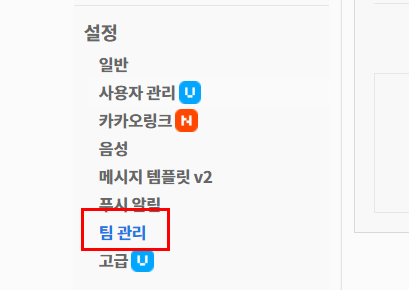

* TOC
{:toc}

## 정리할 내용 

카카오톡 API 사용법 

## 1. App 생성 및 설정 

## 2. 데모 프로젝트 생성 

## 3. 메세지 전송하기 

개발 단계에서 메세지를 전송하기 위해서는 **설정**의 **팀 관리**에 등록된 사람에게만 전송이 가능합니다.  

서비스 단계에서 메세지를 전송하기 위해서는 앱 검수를 받아야합니다. 앱 검수를 받으면 사이트를 통해 로그인을 하고 메세지 수신 동의를 하게 되면 메세지를 보낼 수 있습니다.  

### 3-1. 메세지 전송 방법

1. 카카오 dev를 통해서 App을 만든다. 

2. 사용자가 사이트를 통해 App에 로그인 및 메세지 전송 동의를 한다.  

3. 사용자가 판매 등록버튼을 눌렀을 때 인증이 완료가 되면, 메세지를 보낸다. 

   메세지를 누가 보내주지 ? 등록을 누른 것을 서버가 알고 서버에 데이터가 들어가면 

   ​	