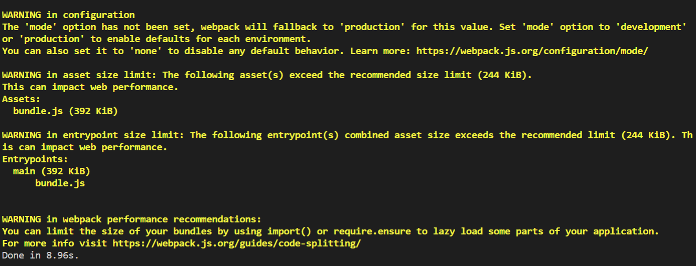
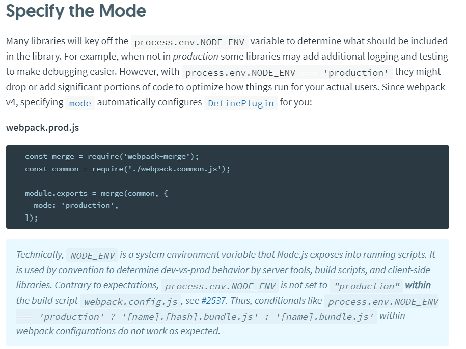

- TOC
  
  {:toc}


### webpack 프로젝트 netlify에 배포하기 




<script async src="https://pagead2.googlesyndication.com/pagead/js/adsbygoogle.js"></script>
<!-- n잡 블로그 사각형 -->
<ins class="adsbygoogle"
     style="display:block"
     data-ad-client="ca-pub-4877378276818686"
     data-ad-slot="2552901794"
     data-ad-format="auto"
     data-full-width-responsive="true"></ins>
<script>
     (adsbygoogle = window.adsbygoogle || []).push({});
</script>

[웹팩 공식 사이트](<https://webpack.js.org/guides/production/>)




`webpack.prod.js`

```js
module.exports = {
  entry: ["./src/index.tsx"],
  mode: "production",
  module: {
    rules: [
      {
        test: /\.tsx?$/,
        use: "ts-loader",
        exclude: /node_modules/
      },
      {
        test: /\.(png|jpg)$/,
        use: ["file-loader"]
      }
    ]
  },
  resolve: {
    extensions: [".tsx", ".ts", ".js"]
  },
  output: {
    path: __dirname + "/build",
    publicPath: "/",
    filename: "bundle.js"
  }
};

```


***

<script async src="https://pagead2.googlesyndication.com/pagead/js/adsbygoogle.js"></script>
<!-- n잡 블로그 사각형 -->
<ins class="adsbygoogle"
     style="display:block"
     data-ad-client="ca-pub-4877378276818686"
     data-ad-slot="2552901794"
     data-ad-format="auto"
     data-full-width-responsive="true"></ins>
<script>
     (adsbygoogle = window.adsbygoogle || []).push({});
</script>

`pakage.json`

```js
{
  "name": "BlockChain-CarMarket",
  "version": "1.0.0",
  "description": "",
  "main": "index.js",
  "scripts": {
    "build": "webpack --config ./webpack.prod.js --mode production",
    "start": "webpack-dev-server --config ./webpack.config.js --mode development",
    "test": "echo \"Error: no test specified\" && exit 1"
  },
  "keywords": [],
  "author": "",
  "license": "ISC",
  "devDependencies": {
    "@types/react": "^16.9.2",
    "@types/react-dom": "^16.9.0",
    "@types/react-redux": "^7.1.2",
    "@types/react-router-dom": "^4.3.5",
    "@types/redux": "^3.6.0",
    "@types/styled-components": "^4.1.18",
    "react": "^16.9.0",
    "react-dom": "^16.9.0",
    "react-redux": "^7.1.1",
    "react-router-dom": "^5.0.1",
    "redux": "^4.0.4",
    "source-map-loader": "^0.2.4",
    "styled-components": "^4.3.2",
    "ts-loader": "^6.0.4",
    "typescript": "^3.6.2",
    "webpack": "^4.41.0",
    "webpack-cli": "^3.3.7",
    "webpack-dev-server": "^3.8.0"
  },
  "dependencies": {
    "axios": "^0.19.0",
    "file-loader": "^4.2.0"
  }
}

```


```bash
yarn add webpack -g
```

```json
"build": "webpack --config ./webpack.prod.js --mode production"
```

설정은 webpack.prod.js파일로 하고 모드는 배포모드로 함.