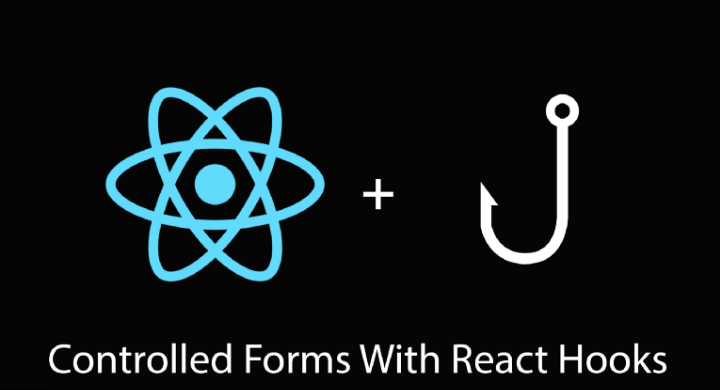

* TOC
{:toc}
## 정리할 내용



React Hooks에 대해서 정리해보겠습니다. 리액트 훅은 리액트 16.8v에 나온 기능입니다. 나오게 된 배경은 함수형 컴포넌트에서도 클래스 컴포넌트처럼 상태관리를 할 수 있는 State를 사용할 수 있게 해주고,  **componentDidMount** , **componentDidUpdate** 와 같은 라이프 사이클을 사용할 수 도 있게 해줍니다. 이처럼 훅의 장점은 원래 함수형에서 할 수 없었던 동작을 하게 해주는 것입니다.   


그럼 주로 사용되는 훅을 정리해보도록 하겠습니다.  


## 1. useState

가장 많이 사용하는 훅으로써 , 함수형 컴포넌트에서도 **State**를 지닐 수 있게 해주는 훅입니다. 함수형 컴포넌트에서 **State**를 사용하고 싶으시다면 사용하시면 됩니다.   


간단한 사용법을 보여드리겠습니다.   


```js
import React, { useState } from 'react';

function Example() {
  // 새로운 state 변수를 선언하고, count라 부르겠습니다.
  const [count, setCount] = useState(0);

  return (
    <div>
      <p>You clicked {count} times</p>
      <button onClick={() => setCount(count + 1)}>
        Click me
      </button>
    </div>
  );
}
```


공식문서에 나와 있는 코드입니다. 해당 코드는 클릭을 하면 숫자를 증가시키는 코드입니다.   


***


 사용하기 위해서 import 해서 사용하시면 되고, react 에서 import하시면 됩니다.  

```js
import React, { useState } from 'react';
```


사용을 할 때는 아래와 같이 사용하시면 됩니다.  

```js
const [count, setCount] = useState(0);
```

useState는 배열을 리턴해주는데 배열의 첫번째 인자는 value를 갖고 있고, 두번 째 인자는 value값을 **setting 해줄 수 있는 함수**를 가지고 있습니다.   


클래스 컴포넌트 때 setState를 사용해서 state값을 변경하지 않으면 reRender되지 않았던 것 처럼 **set함수를 통해서 value를 변경해줄 때 reRender**를 해줍니다.  


한 컴포넌트에서 여러개의 useState를 사용하는 것이 가능하기 때문에 필요하신 만큼 사용하시면 됩니다.  


***


## 2. useEffect

useEffect는 클래스 컴포넌트에 존재했던 **라이프사이클**을 대신해줄 수 있는 훅입니다. 기존의 함수형 컴포넌트에서 렌더링 전 후 시점에 특정 동작을 하기 위해서 할 수 있는 방법이 없었는데, 해당 동작을 하고 싶다면 useEffect를 사용하시면 됩니다.   


### 2.1 componentDidMount & componentDidUpdate

componentDidMount 와 componentDidUpdate의 동작을 해줄 수 있는 useEffect 사용법에 대해 설명 드리겠습니다.  샘플 코드는 아래와 같습니다.  


```js
import React, { useState, useEffect } from 'react';

function Example() {
  const [count, setCount] = useState(0);

  // Similar to componentDidMount and componentDidUpdate:
  useEffect(() => {
    document.title = `You clicked ${count} times`;
  });

  return (
    <div>
      <p>You clicked {count} times</p>
      <button onClick={() => setCount(count + 1)}>
        Click me
      </button>
    </div>
  );
}
```


***


사용법은 useState와 동일하게 react에서 import 해서 사용해야합니다.   

```js
import React, { useState, useEffect } from 'react';
```


import를 했다면 선언을 해줘야 하는데 useEffect는 아래와 같이 사용합니다.  

```js
 useEffect(() => {
    document.title = `You clicked ${count} times`;
  });
```

보시면 파라메터로 아래처럼 생긴 함수를 받았습니다.  

```js
() => {
    document.title = `You clicked ${count} times`;
  }
```

이 함수가 바로 특정 상황일 때 호출될 함수입니다. 그렇다면 어떤 상황에서 호출이 될지는 useEffect의 두번째 파라메터를 통해서 정해줄 수 잇습니다. 지금은 두번 째 파라메터가 존재하지 않고, 그렇기 때문에 컴포넌트가 처음 생성될 때인 componentDidMount와 컴포넌트의 state가 업데이트되어서 발생하는 componentDidUpdate인 상황에서 함수가 호출됩니다.   


***


### 2.2 componentDidMount

state가 달라질 때마다 호출하는 함수 말고 컴포넌트가 처음에 마운트 될 때만 함수를 호출하고싶다면 이 방법을 사용하시면 됩니다.  


```js
import React, { useState, useEffect } from 'react';

function Example() {
  const [count, setCount] = useState(0);

  // Similar to componentDidMount : 
  useEffect(() => {
    document.title = `You clicked ${count} times`;
  },[]);

  return (
    <div>
      <p>You clicked {count} times</p>
      <button onClick={() => setCount(count + 1)}>
        Click me
      </button>
    </div>
  );
}
```


위와 같이 두번째 파라메터로 []를 넣어주면 componentDidMount로 사용할 수 있습니다. 이게 도대체 왜 componentDidMount처럼 동작하는 것인지 궁금하실 것 같아 설명도 넣어놓도록 하겠습니다.   


useEffect의 **두번째 파라메터**는 기본적으로 **어떤 state의 변화를 감지할 것인지 알려주는 곳**입니다. 한 컴포넌트에서 state는 여러개일 수 있고 그렇기 때문에 배열로 넣어줘야합니다.   


처음에 componentDidMount & componentDidUpdate 에서 useEffect를 사용할 때는 두번 째 인자를 아예 넣지 않았기 때문에 모든 state의 변화를 다 감지할 수 있었던 것입니다. 그에 반해, `[]`를 넣어주게 되면 ''**어떠한 state의 변화도 감지하지 않을 것이다**'' 라는 의미입니다. 즉, 컴포넌트가 처음에 만들어질 때만 함수를 호출하게 됩니다.  


***


### 2.3 특정 State의 변화만 감지하고 싶을 경우 

위에서 사용한 것은 componentDidMount였다면, 이번에는 componentDidUpdate로 특정 state가 update되었을 때 호출 하는 방법입니다.  


```js
useEffect(() => {
  document.title = `You clicked ${count} times`;
}, [count]); // Only re-run the effect if count changes
```

componentDidMount와 달라진 점은 `[]`안에 감지하고 싶은 State가 들어있다는 거서 뿐입니다. 사용되는 것을 보니 Vue의 Watch기능과 비슷한 역할을 하는 것 같습니다.   


```js
useEffect(() => {
  document.title = `You clicked ${count} times`;
}, [count , name ]); 
```

위와 같이 작성하면 두가지 state에 대해서 감지가 가능합니다. 하지만 함수는 한가지 이기 때문에 여러 state를 감시하면서 각기 다른 동작을 하게 하고 싶다면, 아래와 같이 작성하면 됩니다.  


```js
useEffect(() => {
  // count가 변했을 때 해야하는 동작
}, [count]);

useEffect(() => {
  // name가 변했을 때 해야하는 동작
}, [name]);
```


여기까지가 함수형 컴포넌트에서 state와 lifecycle을 사용하고 싶을 때 사용하는 훅입니다.   


이제는 **중앙저장소 역할**을 할 수 있는 **useContext**와 react에서 **document.querySelector**와 같은 역할을 할 수 있는 **useRef**에 대해서 정리하고, useState를 사용해 useInput이라는 것을 만드는 것을 정리해보도록 하겠습니다.  


***


## 3. useContext


