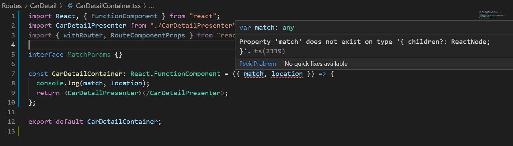
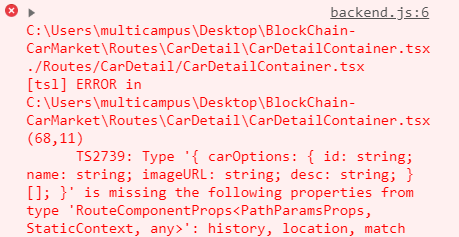

- TOC
  
  {:toc}


## 정리할 내용 


기존의 리액트 프로젝트에서 현재 route에 대한 정보를 얻고 싶다면 **match,locaton,history**를 사용할 수 있었습니다. 하지만 typescript에서 사용할 경우 




```js
import React from "react";
import CarDetailPresenter from "./CarDetailPresenter";
import { RouteComponentProps } from "react-router-dom";

interface MatchParams {}

const CarDetailContainer: React.FunctionComponent<
  RouteComponentProps<MatchParams>
> = ({ match }) => {
  console.log(match);
  return <CarDetailPresenter></CarDetailPresenter>;
};

export default CarDetailContainer;

```


## typescript 에서 RouteComponentProps(location, match, history)와 함께 기존 props사용하기 


전체 코드 

```js
	import React, { FunctionComponent } from "react";
import styled from "styled-components";
import Theme from "../../src/Styles/Theme";
import FatText from "../../src/Components/Commons/FatText";
import { Link, RouteComponentProps, withRouter } from "react-router-dom";

(...스타일 생략...)

// type PathParamsType = {
//   param1: string;
// };

// type PropsType = RouteComponentProps<PathParamsType> & {
//   carOptions: CarOption[];
// };

// 컨테이너에서
interface ICarDetailPresenterProps {
  carOptions: CarOption[];
}

interface PathParamsProps {
  id: string;
}

const CarDetailPresenter: React.FunctionComponent<
  ICarDetailPresenterProps & RouteComponentProps<PathParamsProps>
> = ({ carOptions, match, location, history }) => {
  console.log(carOptions);
  console.log(match, location, history);
  const buyCar = () => {};
  return (
    <Wrapper>
      <CarContainer>
        <CarImageContainer>
          <SelectedCarImage></SelectedCarImage>
          <CarImageList>
            <CarImageItem></CarImageItem>
          </CarImageList>
        </CarImageContainer>
        <CarInfoContainer>
          <CarInfoHeader></CarInfoHeader>
          <CarInfoContent></CarInfoContent>
          <CarInfoBuyButton>
            <Link to={`/buycar/${match.params.id}`}>
              <Button>{"구매"}</Button>
            </Link>
          </CarInfoBuyButton>
        </CarInfoContainer>
      </CarContainer>
      <CarDetailContainer>
        <CarOptionList>
          {carOptions &&
            carOptions.map((carOption: CarOption, index: number) => (
              <CarOptionContainer key={index}>
                <CarOptionItem key={carOption.id}>
                  {carOption.name}
                </CarOptionItem>
                <CarOptionOverLayConatiner>
                  <CarOptionOverLayImage
                    imageURL={carOption.imageURL}
                  ></CarOptionOverLayImage>
                  <CarOptionOverLayDesc>
                    <FatText size={15} text={carOption.name}></FatText>
                    {carOption.desc}
                  </CarOptionOverLayDesc>
                </CarOptionOverLayConatiner>
              </CarOptionContainer>
            ))}
        </CarOptionList>
        <CarPerformance></CarPerformance>
        <CarInsurance></CarInsurance>
      </CarDetailContainer>
    </Wrapper>
  );
};

export default withRouter(CarDetailPresenter);

```


***


```js
interface ICarDetailPresenterProps {
  carOptions: CarOption[];
}

interface PathParamsProps {
  id: string;
}

const CarDetailPresenter: React.FunctionComponent<
  ICarDetailPresenterProps & RouteComponentProps<PathParamsProps>
> = ({ carOptions, match, location, history }) => {}
```

위의 코드를 보면 **ICarDetailPresenterProps**는 **Container**에서 넘겨받는 **Props**를 의미하고 **PathParamProps**는 **RoutecomponentProps**에게 받을 match location, history의 Prop type을 의미합니다.   


두 가지를 동시에 사용하기 위해서 아래와 같은 방식으로 작성해야합니다.  


```
React.FunctionComponent<Props,State>
```

위와 같이 첫번째 인자로 Props에 대한 Type을 넘겨줘야 하기 때문에 &연산자를 사용해서 아래와 같이 두가지 Props에 대한 Type을 React Function Component에게 전해줄 수 있습니다.  

```js
const CarDetailPresenter: React.FunctionComponent<
  ICarDetailPresenterProps & RouteComponentProps<PathParamsProps>
> = ({ carOptions, match, location, history }) => {
}
```


하지만 여기까지 하게 될 경우 아래와 같은 에러를 발생시킵니다.  




이유는 지금 만든 RouteComponentProps는 Type을 정한 것이지 FunctionComponent에게 match, location, history를 넘겨준 것이 아니기 때문입니다. 컴포넌트에게 Route정보를 넘겨주는 역할은 **withRouter**가 해줍니다. 


### withRouter 

withRouter 사용법은 간단합니다.  Link와 RouteComponentProps와 같이 react-router-dom에서 사용할 수 있습니다.  

```js
import { Link, RouteComponentProps, withRouter } from "react-router-dom";
```

컴포넌트를 export default하기 전에 겉에 감싸주기만 하면 됩니다.  

```js
export default withRouter(CarDetailPresenter);
```


[참고사이트](<https://stackoverflow.com/questions/51523211/react-routing-using-routecomponentprops-and-custom-props>)

