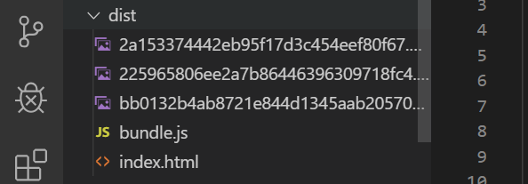

- TOC
  
  {:toc}


웹팩 환경에서 png파일을 로드하기 위해서는 webpack설정을 추가적으로 해줘야 합니다. 

`webpack.config.js`

```json
module.exports = {
  entry: ["./src/index.tsx"],
  module: {
    rules: [
      {
        test: /\.tsx?$/,
        use: "ts-loader",
        exclude: /node_modules/
      },
      {
        test: /\.(png|jpg)$/,
        use: ["file-loader"]
      }
    ]
  },
  resolve: {
    extensions: [".tsx", ".ts", ".js"]
  },
  output: {
    path: __dirname + "/dist",
    publicPath: "/",
    filename: "bundle.js"
  },
  devServer: {
    contentBase: "./dist"
  }
};

```

새로운 rule을 추가해준다.  

png,svg파일을 만나면 `file-loader`를 사용해서 output경로에 내보내는 역할을 합니다.  


`bash`

```bash
yarn add file-loader
```



위와 같이 dist에 이미지가 추가되는 것을 확인할 수 있음. 